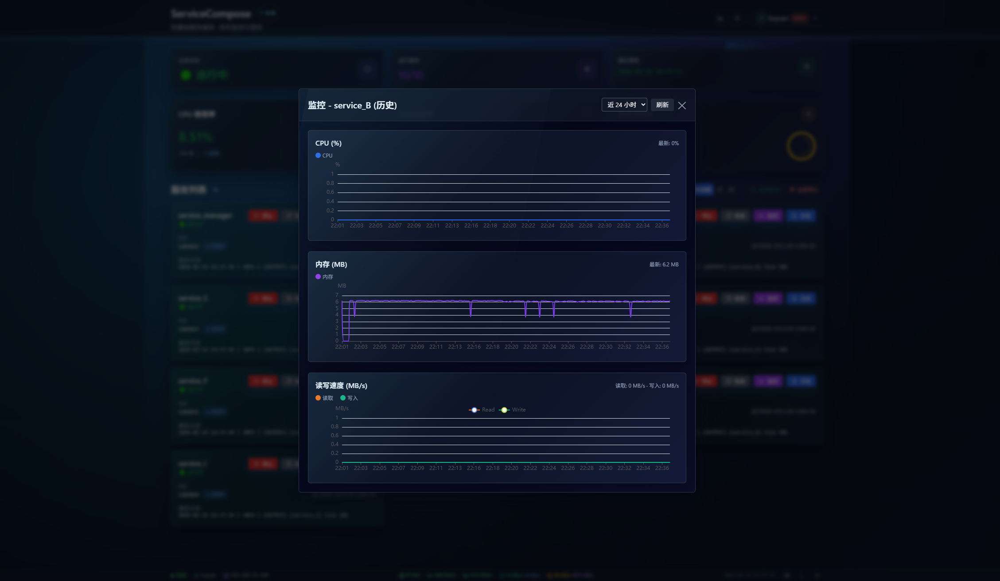
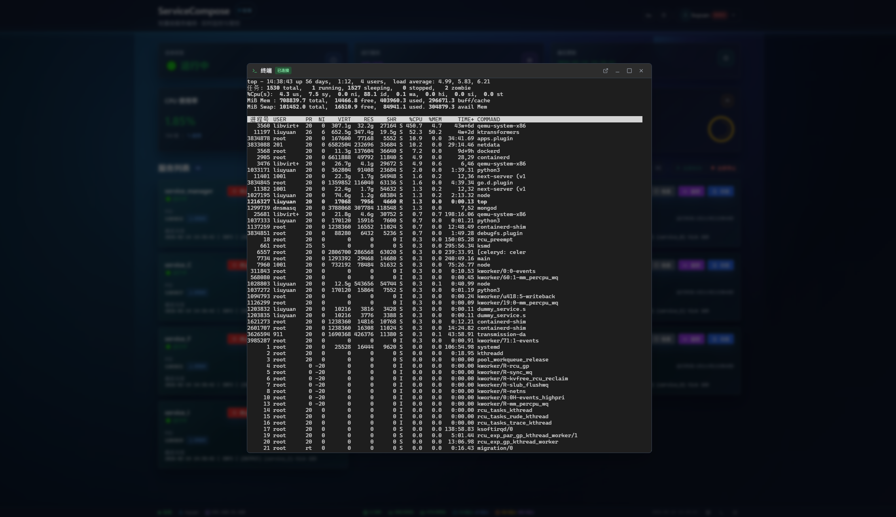

<p align="center">
  
</p>

<h1 align="center">ServiceCompose</h1>

<p align="center">
  <strong>轻量级服务编排工具 —— CLI + WebUI 一体化管控</strong>
</p>

<p align="center">
  <a href="#license"></a>
  
  
  
  
</p>

<p align="center">
  <a href="#-快速开始">快速开始</a> •
  <a href="#-功能特性">功能特性</a> •
  <a href="#-技术栈">技术栈</a> •
  <a href="#-使用示例">使用示例</a> •
  <a href="#-贡献指南">贡献指南</a>
</p>

---

## 📖 简介

**ServiceCompose** 是一个轻量级的多服务编排与管控工具，通过一份 YAML 配置文件即可定义、启停和监控多个服务进程。它同时提供 **CLI 命令行** 和 **WebUI 仪表盘** 两种使用方式，适用于开发、测试和轻量生产环境中的服务编排场景。

> *像 docker-compose 一样声明式地管理你的原生进程。*

## 🖼️ 截图预览

<p align="center">
  
</p>

<details>
<summary>📸 查看静态截图</summary>

| # | 截图 |
|---|------|
| 1 |  |
| 2 |  |
| 3 |  |
| 4 |  |
| 5 |  |
| 6 |  |
| 7 |  |
| 8 |  |
| 9 |  |
| 10 |  |
| 11 |  |

</details>


## ✨ 功能特性

### 🖥️ CLI 命令行

- **声明式配置** — 使用 YAML 定义服务、启动命令、参数和依赖关系
- **依赖拓扑排序** — 按依赖图自动确定启动 / 停止顺序，支持循环依赖检测
- **进程守护** — 崩溃后自动重启，内置指数退避与重启风暴保护
- **PID 管理** — 自动记录和清理 PID 文件
- **滚动日志** — 每个服务独立日志文件，支持自动轮转

### 🌐 WebUI 仪表盘

- **实时监控** — CPU、内存、磁盘、网络 IO 实时指标，每核使用率详情
- **服务控制** — 一键启动 / 停止 / 重启，支持批量操作
- **实时日志** — WebSocket 推送日志流，支持级别筛选、关键字搜索、历史回溯
- **依赖工作流** — 可视化服务依赖拓扑图（拓扑视图 + 力导向视图）
- **进程树** — 查看服务的父子进程关系及各进程资源消耗
- **系统指标趋势** — CPU / 内存使用率历史趋势图表，最长保留 30 天
- **定时重启** — Cron 风格定时重启策略，支持按星期配置
- **热更新 & 回滚** — 上传 `.tar.gz` 更新包在线升级，支持一键回滚至历史版本
- **用户权限** — 多角色权限体系（管理员 / 操作员 / 只读），JWT 认证
- **可见卡片** — 按用户配置仪表盘服务卡片可见性
- **操作审计** — 完整记录所有用户操作历史
- **Web 终端** — 内嵌 xterm.js 终端，在浏览器中直接操作服务器
- **国际化** — 中文 / English 双语切换
- **暗色模式** — 亮色 / 暗色主题自由切换

## 🏗️ 技术栈

| 层         | 技术                                                            |
| ---------- | --------------------------------------------------------------- |
| **后端**   | Python 3.9+, FastAPI, Uvicorn, SQLAlchemy, psutil, PyYAML       |
| **前端**   | Vue 3, Vite, Tailwind CSS, ECharts, xterm.js                   |
| **认证**   | JWT (python-jose), bcrypt (passlib)                             |
| **通信**   | RESTful API + WebSocket                                         |
| **构建**   | Cython 编译 (可选), Vite 打包, Shell 脚本一键构建               |

## 📁 项目结构

```
service-compose/
├── backend/                  # 后端 Python 源码
│   ├── app.py                # FastAPI 主入口 & API 路由
│   ├── service_compose.py    # CLI 核心：进程管理 & 依赖编排
│   ├── services.py           # 系统指标采集 & 心跳检测
│   ├── auth.py               # JWT 认证 & 用户管理
│   ├── config.py             # 全局配置 & 常量
│   ├── models.py             # Pydantic 数据模型
│   ├── logs.py               # 日志链式读取 & 轮转
│   ├── tasks.py              # 后台定时任务
│   ├── scheduled.py          # 定时重启解析
│   ├── audit.py              # 操作审计日志
│   └── update.py             # 热更新 & 回滚
├── frontend/                 # 前端 Vue 3 源码
│   ├── src/
│   │   ├── components/       # Vue 组件
│   │   └── composables/      # 组合式函数 (hooks)
│   └── package.json
├── examples/
│   ├── services.yaml         # 示例配置文件
│   └── dummy_service.sh      # 示例服务脚本
├── build.sh                  # 一键构建打包脚本
├── start_all.sh              # 一键启动 (服务 + API)
├── stop_all.sh               # 一键停止
├── requirements.txt          # Python 依赖
└── README.md
```

## 🚀 快速开始

### 环境要求

- Python 3.9+
- Node.js 16+ (仅前端开发需要)
- Linux 操作系统

### 1. 安装依赖

```bash
# 克隆仓库
git clone https://github.com/liuyuansharp/service-compose.git
cd service-compose

# 安装 Python 依赖
pip install -r requirements.txt

# 安装前端依赖 (可选，仅开发时需要)
cd frontend && npm install && cd ..
```

### 2. 编写配置文件

创建 `services.yaml`：

```yaml
services:
  - name: gateway
    cmd: ./start_gateway.sh
    args: []
    restart_on_exit: true
    heartbeat: http://localhost:8000/health
    depends_on: []

  - name: user-service
    cmd: python3
    args: ["-m", "user_service.main"]
    restart_on_exit: true
    heartbeat: http://localhost:8001/health
    depends_on:
      - gateway

  - name: order-service
    cmd: python3
    args: ["-m", "order_service.main"]
    restart_on_exit: true
    heartbeat: http://localhost:8002/health
    scheduled_restart:
      enabled: true
      cron: "03:00"
    depends_on:
      - gateway

run_dir: ./.services
```

### 3. 使用 CLI 启动

```bash
# 启动所有服务（按依赖顺序）
python3 -m backend.service_compose start --config services.yaml

# 启动单个服务
python3 -m backend.service_compose start --config services.yaml --service gateway

# 查看状态
python3 -m backend.service_compose status --config services.yaml

# 停止所有服务（按反向依赖顺序）
python3 -m backend.service_compose stop --config services.yaml

# 重启单个服务（后台守护模式）
python3 -m backend.service_compose restart --config services.yaml --service user-service --daemon
```

### 4. 使用 WebUI

```bash
# 一键启动 (服务进程 + API 后端)
./start_all.sh services.yaml

# 或手动启动后端 API
python3 -m backend.app --config services.yaml --host 0.0.0.0 --port 8080

# 开发模式启动前端
cd frontend && npm run dev
```

访问 `http://localhost:8080` 打开仪表盘（默认用户: `admin` / `admin`）。

## 📝 使用示例

### 快速体验 (示例服务)

```bash
# 使用自带的示例配置和脚本
./start_all.sh examples/services.yaml

# 浏览器访问
# 仪表盘: http://localhost:8080
# API 文档: http://localhost:8080/api/docs

# 停止
./stop_all.sh examples/services.yaml
```

### 生产构建

```bash
# 完整构建（Cython 编译 + 前端打包 + tar.gz）
./build.sh --version 1.2.0

# 跳过前端编译
./build.sh --skip-frontend

# 跳过 Cython 编译
./build.sh --skip-cython
```

### 配置说明

| 字段                | 类型     | 说明                                          |
| ------------------- | -------- | --------------------------------------------- |
| `name`              | string   | 服务名称（唯一标识）                          |
| `cmd`               | string   | 启动命令（支持相对路径，相对于配置文件目录）   |
| `args`              | string[] | 启动参数列表                                  |
| `restart_on_exit`   | bool     | 进程退出后是否自动重启（指数退避）             |
| `heartbeat`         | string   | 心跳检测 URL 或 `mock`                        |
| `depends_on`        | string[] | 依赖的服务名列表（决定启停顺序）               |
| `scheduled_restart` | object   | 定时重启配置                                  |
| `run_dir`           | string   | 运行时目录（日志、PID 文件存放路径）           |

### API 端点一览

| 方法     | 路径                         | 说明            |
| -------- | ---------------------------- | --------------- |
| `POST`   | `/api/login`                 | 用户登录        |
| `GET`    | `/api/status`                | 仪表盘状态      |
| `POST`   | `/api/services/{name}/start` | 启动服务        |
| `POST`   | `/api/services/{name}/stop`  | 停止服务        |
| `POST`   | `/api/services/{name}/restart` | 重启服务      |
| `GET`    | `/api/logs/{name}`           | 获取服务日志    |
| `GET`    | `/api/metrics/{name}`        | 获取监控指标    |
| `WS`     | `/api/ws/logs/{name}`        | 实时日志流      |
| `WS`     | `/api/ws/terminal`           | Web 终端        |
| `GET`    | `/api/docs`                  | Swagger API 文档 |

完整 API 文档请启动服务后访问 `/api/docs`。


## 🤝 贡献指南

欢迎提交 PR！请先阅读 [CONTRIBUTING.md](CONTRIBUTING.md)。

1. Fork 本仓库
2. 创建特性分支 (`git checkout -b feature/awesome-feature`)
3. 提交变更 (`git commit -m 'feat: add awesome feature'`)
4. 推送分支 (`git push origin feature/awesome-feature`)
5. 创建 Pull Request

## 📄 License

本项目使用 [MIT License](LICENSE) 开源。

---

<p align="center">
  Made with ❤️ by <a href="https://github.com/liuyuansharp">ServiceCompose Contributors</a>
</p>